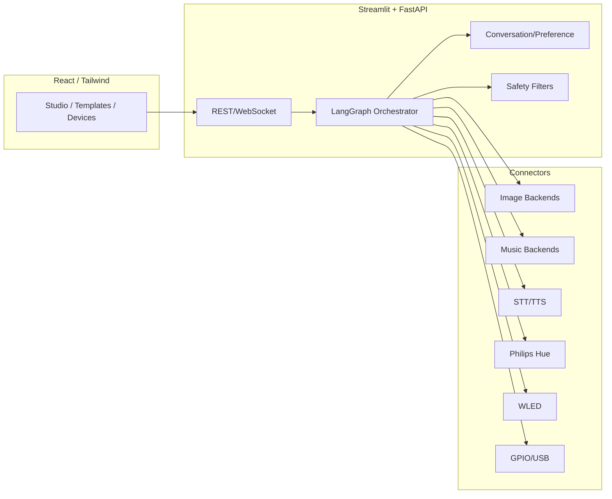
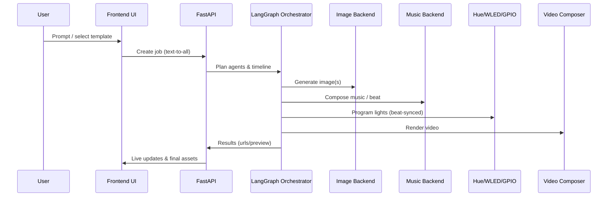

# 🌟 AgentLoom｜灵构织机

**One loom to orchestrate multi‑modal, multi‑agent creation**

[简体中文](README.zh-CN.md) | English

> New: Real-time Text → Image → Music → Lights → Video with true device control (Hue/WLED & GPIO/USB on Raspberry Pi/Arduino). Five scene templates: Director, Kids Theater, Wellness, Party DJ/VJ, Home Recipes. Quick start below.

---

## Why it stands out

- 🧠 Agentic orchestration: LangGraph‑based multi‑agent planning with memory, feedback, and safety.
- 🎛️ Text‑to‑Everything pipeline: one workflow to generate image, compose music, choreograph lights, and render video.
- 💡 Device‑native: first‑class Philips Hue / WLED support to run your actual room.
- 🔌 Pluggable backends: SD WebUI / HTTP models with latency/cost profiling and health checks.
- 🧪 Feedback → Auto‑tuning: collect ratings, learn preferences, and surface optimization suggestions.
- 📦 Task queue UX: pause / resume / retry with persistent progress cards.
- 🧭 First‑run wizard: write `.env` + device params in minutes.
- 🏢 Enterprise‑ready: license gating, audit logs, role‑based hooks.

## What you can build in 60 seconds

- “Cozy jazz bar” → cinematic image + mellow soundtrack + warm lighting show + MP4
- Upload a photo → matching soundtrack + mood‑aligned lighting
- Drop a song → beat‑synced lighting with presets for Hue/WLED

## Quick start

### Windows (PowerShell)
1. `cd multiscen`
2. `powershell -ExecutionPolicy Bypass -File setup.ps1`
3. `streamlit run app.py`

### macOS/Linux
1. `cd multiscen && bash setup.sh`
2. `streamlit run app.py`

### Optional frontend (React)
- `cd multiscen/frontend && npm install && npm start`

### CLI
- `mscen gen "sunset jazz bar" --video`
- `mscen list`

## Deployment

- System Requirements
  - Python 3.9+; Node 18+ (for React frontend); FFmpeg (video)
  - Recommended: 8GB RAM+, GPU optional; Raspberry Pi/Arduino for GPIO/USB
- Environment Variables (.env)
  - Minimal
    - `OPENAI_API_KEY=...`
  - Devices
    - `HUE_BRIDGE_IP=192.168.1.100`
    - `HUE_USERNAME=your_hue_username`
    - `WLED_IP=192.168.1.101`
    - `GPIO_ENABLED=true`
    - `ARDUINO_SERIAL=COM3` (or `/dev/ttyUSB0`)
- Example .env
```
OPENAI_API_KEY=sk-...
HUE_BRIDGE_IP=192.168.1.100
HUE_USERNAME=your_hue_username
WLED_IP=192.168.1.101
GPIO_ENABLED=true
ARDUINO_SERIAL=COM3
```
- Docker (optional)
```
docker-compose up -d
```

## Architecture at a glance





- Backend: Streamlit + FastAPI + LangGraph (feedback learner, model optimizer)
- Frontend: React + TypeScript + Tailwind (real‑time agent/queue views)
- Connectors: SD WebUI, HTTP image/music/STT/TTS, Hue/WLED devices
- Enterprise: License server, audit logger, security hooks

## Live demos

- Web UI: Text‑to‑Everything studio, real‑time device control
- Mock API: `docker-compose up -d mock-api`
- Short video/GIFs: coming soon (PRs welcome!)

## Roadmap (highlights)

- Strategy‑based routing (lowest latency / lowest cost / balanced)
- Auto‑tuned parameter replay (one‑click “apply suggestions”)
- Multi‑user spaces and approval workflows

## Contributing

- Star ⭐ if this saves your time; PRs welcome
- Use Issues for bugs/ideas, Discussions for design talks
- Sponsors/Backers: see `.github/FUNDING.yml`

## License

MIT — build amazing things.
