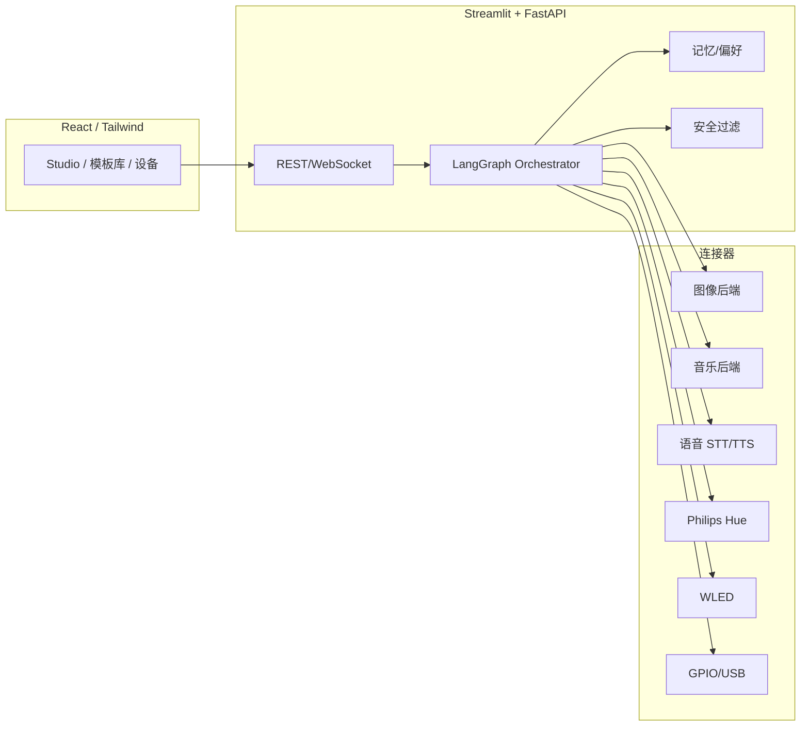
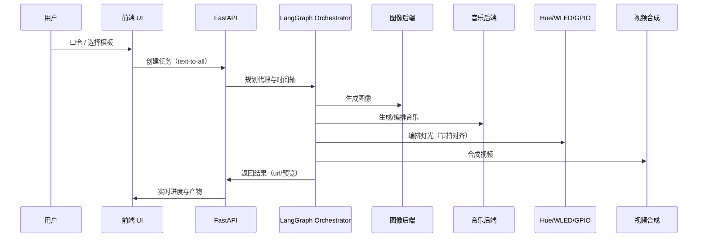

# 🌟 多模态 AI 编排平台

[](https://github.com/qq749812679/AgentLoom/actions)
[](https://github.com/qq749812679/AgentLoom/releases)
[](https://qq749812679.github.io/Multi-Modal-AI-Orchestrator)

[English README](README.md) | 简体中文

> 新版发布：实时“文字 → 图片 → 音乐 → 灯光 → 视频”统一时间轴同步，直连真设备（Philips Hue/WLED & 树莓派/Arduino 的 GPIO/USB）。内置五大场景：情境导演、亲子即兴剧场、身心调谐、派对 DJ/VJ 协作台、家居情境食谱。下方 3 分钟快速上手。

把“一个想法”变成“可看、可听、可控”的沉浸式体验：一条流水线完成 文字 + 图片 + 音乐 + 灯光 + 视频，并能直接操控 嵌入式等硬件 真设备。

---

## 为什么它与众不同

- 🧠 **Agent 智能编排**：基于 LangGraph 的多 Agent 规划，带记忆、反馈与安全约束。
- 🎛️ **文本到一切（Text‑to‑Everything）**：一次输入，产出图片、音乐、灯光、视频全链路结果。
- 💡 **真设备优先**：不仅是屏幕预览，直接接管 Philips Hue / WLED 房间灯光。
- 🔌 **后端可插拔**：SD WebUI / HTTP 模型随插随用，支持延迟/成本画像与健康探测。
- 🧪 **反馈→自动调参**：收集评分、学习偏好，自动给出优化建议与预计收益。
- 📦 **任务队列体验**：暂停/恢复/重试 + 持久进度卡片，真正可运营。
- 🧭 **首启向导**：一步写好 `.env` 与设备参数，新手 3 分钟起飞。
- 🏢 **企业能力**：License 开关、审计日志、权限钩子，易于内外网落地。

## 60 秒你能做什么

- “温暖爵士吧”→ 电影感图片 + 情绪契合音乐 + 暖色灯光编排 + MP4
- 上传一张图 → 生成匹配情绪的配乐 + 同步灯光
- 拖入一段歌 → 节拍对齐的灯光节目，导出 Hue/WLED 预设

## 快速开始

### Windows（PowerShell）
1. `cd multiscen`
2. `powershell -ExecutionPolicy Bypass -File setup.ps1`
3. `streamlit run app.py`

### macOS/Linux
1. `cd multiscen && bash setup.sh`
2. `streamlit run app.py`

### 可选前端（React）
- `cd multiscen/frontend && npm install && npm start`

### CLI
- `mscen gen "sunset jazz bar" --video`
- `mscen list`

## 部署配置

- 系统要求
  - Python 3.9+；Node 18+（前端）；FFmpeg（视频）
  - 建议：内存 8GB+；可选 GPU；GPIO/USB 建议 Raspberry Pi/Arduino
- 环境变量（.env）
  - 最小配置
    - `OPENAI_API_KEY=...`
  - 设备
    - `HUE_BRIDGE_IP=192.168.1.100`
    - `HUE_USERNAME=your_hue_username`
    - `WLED_IP=192.168.1.101`
    - `GPIO_ENABLED=true`
    - `ARDUINO_SERIAL=COM3`（或 `/dev/ttyUSB0`）
- .env 示例
```
OPENAI_API_KEY=sk-...
HUE_BRIDGE_IP=192.168.1.100
HUE_USERNAME=your_hue_username
WLED_IP=192.168.1.101
GPIO_ENABLED=true
ARDUINO_SERIAL=COM3
```
- Docker（可选）
```
docker-compose up -d
```

## 架构速览





- 后端：Streamlit + FastAPI + LangGraph（反馈学习、模型优化）
- 前端：React + TypeScript + Tailwind（实时 Agent/队列可视化）
- 连接器：SD WebUI、HTTP 图像/音乐/STT/TTS、Hue/WLED 设备
- 企业：License Server、审计日志、Security Hooks

## Demo

- Web UI：文本→一切工作室、实时设备控制
- Mock API：`docker-compose up -d mock-api`
- 短视频/GIF：欢迎社区 PR 一起完善

## 路线图（节选）

- 策略路由：最低延迟/最低成本/平衡
- 一键“按建议重跑”（Auto‑Tune Replay）
- 团队空间与审批流

## 参与共建

- 如果它帮到你，请点个 ⭐ Star；欢迎提交 PR
- Bug/想法用 Issues，方案讨论走 Discussions
- 赞助/支持请见 `.github/FUNDING.yml`

## 许可证

MIT — 去创造更酷的多模态体验吧。 